# field-compiler — RSW-1

Native macOS implementation of the Field Compiler.
Spec: [`papers/replicator_field_compiler.html`](../papers/replicator_field_compiler.html) (v0.8).
CAD: [`CAD.md`](CAD.md) — the free-standing RH-1 as a parametric solid model inside the twin.

## Build and run

No Xcode required — Command Line Tools only.

```sh
swift build -c release
./.build/release/fieldc test              # unit suite (62 tests; FIELDC_VERBOSE=1 prints every measured value)
./.build/release/fieldc gate --receipt    # physics acceptance gates, writes Receipts/
./.build/release/fieldc machine           # the simulated machine: RH-1 free-standing, room air (--desktop: frozen v0.3)
./.build/release/fieldc focus             # compile a centre trap on the full chamber (GPU port fields)
./.build/release/fieldc gpu               # Metal propagator + port-field kernel vs CPU reference
./.build/release/fieldc drift --receipt   # how fast a compiled trap goes stale as the air warms
./.build/release/fieldc forcetrap --receipt   # compile for force vs GS-PAT: unique trap? thermal hold? (--glass)
./.build/release/fieldc tonesweep --receipt   # glass chamber: sibling ratio vs number of tones (--target, --liner)
./.build/release/fieldc wallsweep --receipt   # glass liner / plate reflection grid (--plates)
./.build/release/fieldc levitate --receipt    # the drive to hold PLA / aluminium / steel against gravity, in SI
./.build/release/fieldc carry --receipt       # pick up, carry 5 mm up and 5 mm across, place (G-P1)
./.build/release/fieldc fly --receipt         # integrate a PLA bead through the carry: drive level × step time (G-P2)
./.build/release/fieldc build --receipt       # the first build: N beads laid in a row on a support (G-B1; --beads N)
./.build/release/fieldc build --shape tetra --row-dir y --receipt   # four beads: a triangle and one in its pocket (G-B2)
./.build/release/fieldc arraysweep --receipt  # open air: what N elements per plate and the tones buy (study S1)
./.build/release/fieldc mold --receipt        # the sieve in open air, 2 × 192 elements (--shape tetra, --rotate, --sites, --light)
./.build/release/fieldc mold --chamber glass --receipt   # the glass chamber of Rounds 7–11 (--objective wells: the λ/4 limit)
./.build/release/fieldc scan3d --object ring --receipt   # gated pulse-echo scan in open air (point | ring | tetra | R; --chamber glass)
./.build/release/fieldc replicate --receipt   # scan → read the shape → mold a copy → scan the copy (--object tetra)
./.build/release/fieldc render iso a.png  # offscreen machine render, no window server
./.build/release/fieldc shot --all        # every UI scene, both themes + contact sheet
./.build/release/fieldc broadband         # channel-count study: free field vs cavity+chord
./.build/release/fieldc cad check --rules  # the RH-1 solid model: CAD gates + design rules
./.build/release/fieldc cad render --all   # iso, front, section, detail, plate, storage, top
./.build/release/fieldc cad export         # STL per part, OBJ+MTL, params, BOM, GA drawing
./.build/release/fieldc cad step           # B-rep STEP assembly via CadQuery, volume-gated
./.build/release/fieldc plates             # can 6 throat gates hold a trap? (model study)
```

## Status — honest

**2026-09-28 — the machine exists as CAD, and the physics reads it.** The
twin now carries the free-standing RH-1 (Ø460 × 1650, three plate assemblies,
four radiating faces, two chambers, rotating glass, arcade, six photonic bays)
as a parametric solid model built from the newest sources — etherworks.io
(2026-08-10), mech §3c (2026-08-03), spec v0.4 — with every number's
provenance and nine documented conflicts resolved in code (see
[`CAD.md`](CAD.md)). 92 closed solids, 9 CAD gates + 25 design rules, a shaded
section-cut Machine tab, STL/OBJ/STEP exports with a cross-kernel volume gate.
A new preset, `RH1Freestanding`, takes its acoustic apertures from the CAD's
plate faces and its gates from the throat piezos; the desktop preset (`RH1`,
24 panel gates) is FROZEN: it backs the historical solver gates below and
replays old receipts, nothing else.

**2026-09-29 — every mode now simulates the free-standing machine, in real
air.** Compile/Build/Inspect, the viewport chrome, `focus` and `render` run on
`RH1Freestanding.standard()`: 6 throat gates, 17 184 virtual apertures, both
plates as walls, humid air at 20 °C / 50 % RH. See "Round 6" below.

**2026-09-29, later — the glass chamber, exactly, and unique traps inside it.**
The build chamber is modelled as the glass cylinder it is (bare or lined), and
a force compiler that works in its speckle holds one trap with 3–10 tones, on
axis and off. A liner is not the lever; temperature tracking is. See "Round 7".

**2026-09-29, evening — how hard to drive, and a carried bead.** In SI units a
PLA bead needs ~160 dB and steel ~168 dB in the glass chamber (MODEL: the horn
is a stub). The twin carries a trap 5 mm up and 5 mm across on its point,
downhill every step (G-P1). A PLA bead integrated through the fields rides it
at 4× the holding drive, 10 mm in 0.4 s (G-P2). See "Round 8".

**2026-09-30 — the first builds.** Five PLA beads are laid in a row on a
support, each within 2–3.5 µm of its site and touching its neighbour (7–9 µm
gaps). This works by compiling the force balance rather than the potential
minimum, and by placing closed-loop (G-B1). A tetrahedron follows: a fourth
bead rests on three, touching all of them (G-B2). See "Round 9".

**2026-09-30, night — scan an object, mold from powder.** The twin images a
3D object from the six gates (a 30 mm tetrahedron frame at 100 % recall; the
letter R readable). A random cloud of Ø40 µm powder then ends 100 % on a
16-site ring, and 100 % on a 12 mm tetrahedron frame, within 2–4 s. That works
as a sieve: gravity carries the powder, and the compiled field makes the shape
the only place that can hold a grain up. A mold of wells alone catches only
the ~23 % that starts within λ/4 of the shape. Open: an even share per site.
See "Round 11".

**2026-10-01 — the axis bug.** The GPU cavity fields were exactly zero on the
chamber axis, where every mid-plane target sits. Fixed and gated
(G-GPU-CYL-axis); every affected receipt was re-run at 77df809, and the
conclusions of Rounds 7–11 hold with corrected numbers. See "Round 11".

**2026-10-01, later — open air, and the loop closes.** Per
[`ENGINE.md`](ENGINE.md) the glass is gone: two Ø410 mm plates in open air,
each a surface of N independently driven elements. The engine is
matrix-free on the GPU (a mold compile takes minutes of GPU and seconds of
CPU) with basin maps instead of particle stepping. Channels buy power; tones
buy confinement (2 × 192 elements, 9 tones over 30–70 kHz). The scan is
time-gated pulse-echo. The replicator's loop — scan a wire ring, read it,
mold it from powder, scan the copy — closes with every gate passing. Open:
reading small 3D wireframes; evenness that does not depend on orientation.
See "Round 12".

**Implemented and gated:** FieldCore (pure Swift, zero dependencies) —
complex/vector math, RH-1 geometry, mesh + voxelizer, T0 Rayleigh–Sommerfeld
propagator with exact adjoint, T1 acoustic FDTD, T2 Gor'kov radiation force,
the inverse solver (IBP / GS-PAT / Diff-PAT), gate framework and receipts.

**FieldGPU (Metal):** runtime-compiled shaders, GPU propagator validated against
the CPU reference to 3.8e-6, scene geometry for the RH-1 machine, an orbit camera,
and offscreen rendering to CGImage — the viewport half of the screenshot harness,
working with no window server.

**FieldUI (SwiftUI):** the slicer shell — mode tabs, object rail, viewport pane
with overlay chips, inspector, transport bar — as a pure function of `AppState`
(law L1). Dark and light themes. An 8-scene registry and a contact-sheet
generator; `fieldc shot --all` produces 16 PNGs plus two contact sheets headlessly.

**Machine model now carries the two levers a plain-array model lacks:** cavity
walls (axial image sources) and per-tone rainbow gate→element weights.

**Scan pipeline (M7) — wired end to end, physics PARTLY validated.**
`fieldc scan` runs: FDTD pulse-echo with a scatterer → empty-chamber reference →
differential → real S[rx][tx] scattering matrix → matrix pencil → chords →
`.pattern` → Machine View L0 → gates. Working and gated: `.pattern` round trip
bit-exact (G11), reciprocity QC on a genuine scattering matrix (G15, 0.001), and
**L1 DORT correctly REFUSES to image without a measured Green's function** — the
guard that stops a confident, sharp, meaningless picture reaching a `.pattern`.
Chord extraction recovers a pole at **10.68 kHz against a 10.72 kHz drive**,
which says the pencil is finding real physics.

**Not yet built / not yet working:** T0.5 BEM, T1f CBS, T3 consolidation,
`.fcode` I/O, Machine View L2–L3, golden-image *diffing* (screenshots generate
but are not compared against committed goldens), live MTKView interaction.

So: **M0–M2 and M4 done and gated; M1 done for geometry and viewport; M7 wired
with two known defects (below); M3, M5, M6, M8, M9 not.**

## Gate results (Apple M5)

All 10 gates pass. `G9b` reports informational — see below.

| gate | measures | result |
|---|---|---|
| G1 | voxelizer volume vs 4/3πr³ | 0.40% (bar 2%) |
| G2 | energy drift, lossless, 10k steps | 0.71% (bar 1%) |
| G3 | axial round-trip time of flight | 0.44% (bar 2%) |
| G6 | standing-wave node spacing vs λ/2 | 2.5e-5 (bar 1%) |
| G7 | Gor'kov numeric vs closed form | 3.6e-7 (bar 2%) |
| G9a | lateral focus placement, single plate | 1.79 mm (bar 2.64 mm) |
| G9c | best method vs IBP focusing gain | 1.00× (bar > 0.98) |

## Round 12 — open air, physics-limited plates, an engine built on linearity (2026-10-01)

Built to [`ENGINE.md`](ENGINE.md), after the operator's decisions of 1 October:

* keep the cylinder but drop the glass (two Ø410 mm plates, 460 mm apart,
  open air between them);
* make each plate a holographic surface limited by physics, not by "three
  horns per face";
* make the engine efficient before spending compute on it.

### The engine

* **Plates of independently driven elements** (`PlateArray`). Each plate
  carries N Ø5 mm pistons on a Vogel spiral, so every element sits at its
  own radius and there are no grating lobes. Each element has its own drive
  channel. The plates reflect with R = 0.9, imaged to order 3.
* **Matrix-free on the GPU** (`ArrayFieldGPU`, `Shaders/array.metal`).
  * One pass gives p and ∇p at any points for a drive.
  * A second gives, for every element, the gradient of any weighted sum of
    the Gor'kov potential.
  * Nothing is stored, so N can be thousands.

  Gates: G-A1 (potential vs the CPU reference) 3.4e-5; G-A3 (adjoint)
  5.6e-5; G-A2 (one element vs the Rayleigh integral over its face, at
  230 mm and 0–42°) 0.87 %.
* **One compiler for any field** (`ForceCompiler.ForceField`). The mold,
  funnel and sieve compilers run on the glass chamber's stored rows or on
  the plate array.
* **Basin maps instead of trajectories** (`BasinMap`). Overdamped powder
  slides down U_eff = P·U + mgz and stops in a minimum. So every lattice cell
  points to its steepest descent, and following the pointers gives the end
  of every start at once. Recirculation closes in one line. G-B0: the basin
  map and 3,000 stepped grains agree on the share that ends on the shape.
* **Basin-map feedback.** Sites that get less than their fair share are
  weighted up and the drive is recompiled from the last one. This is what
  the machine would do with a scan.
* **Cost.** A mold compile at the design point takes 2–3 minutes of GPU
  time with a few seconds of CPU; a scan takes ~45 s; peak memory is
  ~50 MB.
  * Per-call GPU buffers were first kept alive by their command buffers and
    grew 0.4 GB/s. That killed the first sweep silently. Buffers are now
    allocated once per field.

### What the channel count and the tones buy (`fieldc arraysweep`, study S1; receipt at 9e5b63d)

Centre-trap ratio (< 0.5 = unique), and the 16-site ring sieve by the basin map:

| per plate | tones (30–70 kHz) | trap ratio | powder on the ring | sites (fair 6.25 %) | drive per element | acoustic power |
|---|---|---|---|---|---|---|
| 3 | 1 | 0.78 | 4 % | — | 476 m/s | 5,512 W |
| 12 | 3 | 0.18 | 97 % | 0–25 % | 51 m/s | 745 W |
| 48 | 9 | 0.10 | 100 % | 0–16.5 % | 10 m/s | 349 W |
| 192 | 1 | 0.67 | 15 % | — | 9.2 m/s | 131 W |
| 192 | 9 | 0.11 | 100 % | 3.3–8.6 % | 2.2 m/s | 67 W |
| 768 | 9 | 0.08 | 100 % | 4.0–9.3 % | 0.62 m/s | 21 W |

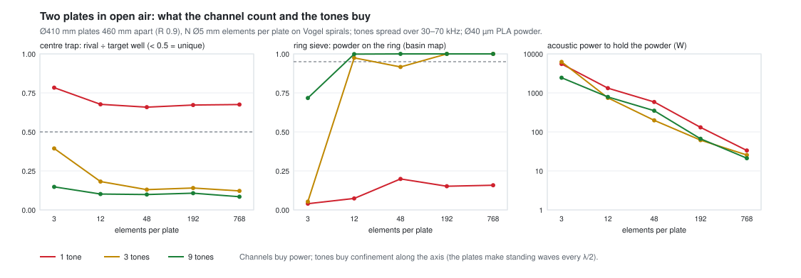

* **Tones buy confinement along the axis.** Two plates make standing waves
  every λ/2 all the way between them, so lift exists at every node plane.
  Only frequency diversity localises it. One tone never makes a unique trap
  (~0.7 at any N). Nine tones over 30–70 kHz make the centre trap unique
  (~0.1), and the sieve puts all the powder on the ring. This is Round 7's
  "tones are drives", now separated from the channel count.
* **Channels buy power and evenness.** Going from 3 to 768 elements per
  plate cuts the acoustic power ~100–170×. Every site getting its share needs
  192 or more.
* **Design point:** 2 × 192 elements, 9 tones over 30–70 kHz. That is
  ~2.2 m/s rms per element and ~67 W acoustic to hold the whole powder
  cloud. At 2 × 768 it drops to 0.6 m/s and 21 W.

### Molds in open air (receipts at 9af9c1f)

At the design point (2 × 192 elements, 9 tones), with the basin map and
3,000 stepped grains:

* **The 16-site ring:** 100 % of the powder ends on the ring. All 16 sites
  hold powder (3.3–8.6 % each against a fair 6.25 %; grains 21–348 each).
  Nothing is left in a rogue well; 1.2 re-sprinkles per grain (G-M1, G-M2,
  G-B0 pass).

  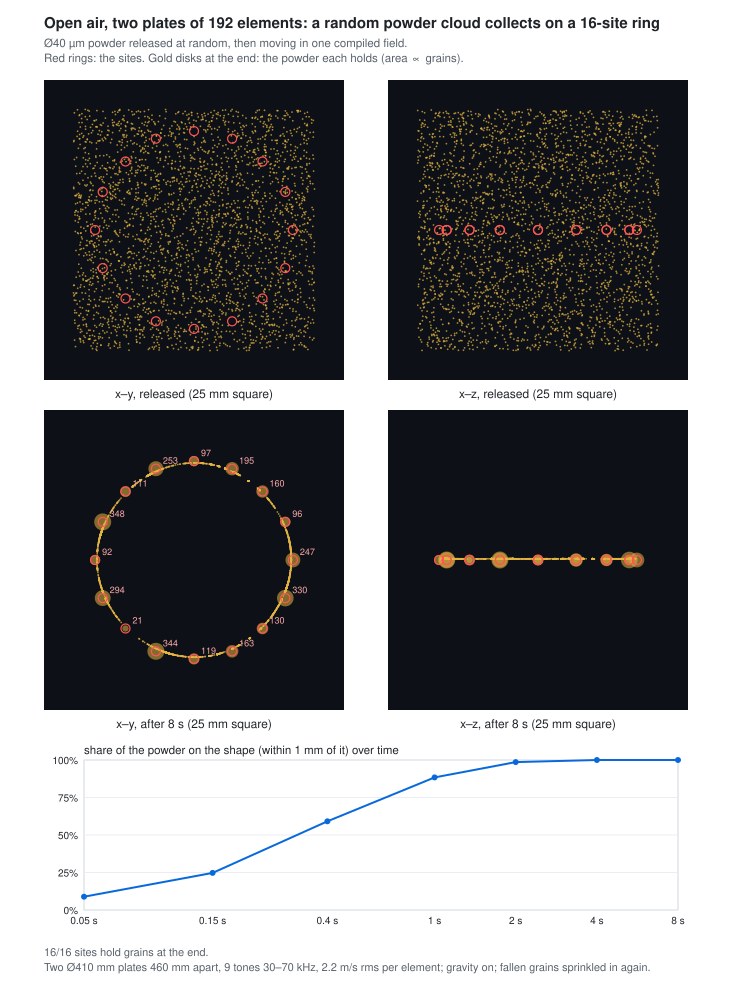
* **The 12 mm tetrahedron frame, in 3D:** 98.5 % on the frame by the basin
  map, 100 % by the grains. All 10 sites hold powder (7.7–13.1 % against a
  fair 10 %) (G-M1, G-M2, G-B0 pass).

  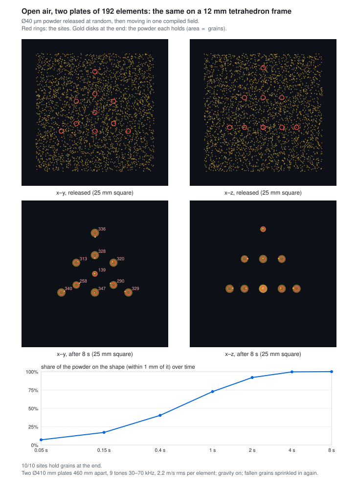
* **Evenness depends on orientation (found by turning the shape).**
  * Capture onto the shape is robust: 100 % at every rotation tried.
  * Even filling is not. The 16-site ring (sites 3.1 mm apart) leaves sites
    empty when turned 5° or 11.25°.
  * With 12 sites (4.2 mm apart) every site fills at 0° and 5° (7.4–9.1 %,
    6.4–10.3 %) but one stays empty at 11.25°.

  The plates' Vogel spirals are not rotationally symmetric, and 3.1 mm is
  only ~1.3 half-wavelengths at 70 kHz. Feedback rounds (weight starved
  sites up, recompile) have not recovered a site the powder never reaches.

### Scans in open air: pulse-echo, time-gated

A first version lit the object with random chords on both plates and listened
on both. That is mostly transmission (plate → object → other plate), whose
path barely changes with height, so the image smeared ~10 mm along z. The
reflecting plates add plate → object → far plate → home paths of 2L whatever
the height. The scan is now pulse-echo, one plate at a time:

* coded pulses (one random phase pattern per plate, the same at every
  frequency);
* 320 frequencies over 30–100 kHz (a 4.6 ms window);
* a time gate on the direct echoes (1.2–1.9 ms; the first plate bounce
  arrives at 2.7 ms).

A point's half-peak volume fell from 3,726 voxels to 320.

| object | bright voxels on the object | object recalled | peak offset | time |
|---|---|---|---|---|
| a point | 77 % | 100 % | 1.0 mm | 35 s |
| a wire ring, 8 mm radius | 92 % | 100 % | 0.3 mm | 35 s |
| a 30 mm tetrahedron frame | 67 % | 56 % | 1.0 mm | 31 s |
| the letter R, 40 mm | 73 % | 54 % | 1.5 mm | 31 s |

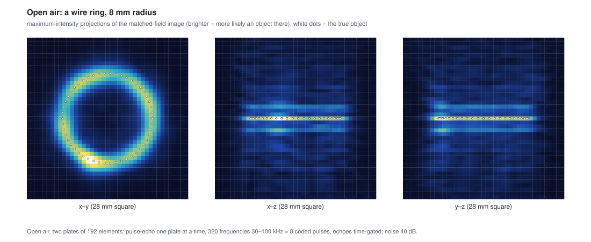

The glass chamber's scan took ~5 minutes; these take ~30 s and are cleaner
(higher precision). They recall less of the big objects above half the peak,
because faces turned to the plates echo much more strongly than edges.

### The replicator loop (`fieldc replicate`)

Scan an object, read its shape off the image, mold a copy from powder with
the sieve, scan the copy, and compare. Reading the shape:

* peaks at least 3 mm apart above half the image's maximum;
* each peak moved to the brightness-weighted centroid of its patch
  (sub-voxel);
* sites resampled at equal arc length along every chain and loop, ~4 mm
  apart.

**A wire ring (8 mm radius): the loop closes.** All six gates pass:

* G-R1: 12 sites read, all on the ring (worst 0.39 mm).
* G-M1, G-M2: 100 % of the powder ends on the read shape, every site filled.
* G-R2: the copy lies on the ORIGINAL ring: 100 % of the cloud within
  1.5 mm of it, median 0.45 mm.
* G-R3: the copy's scan correlates 0.72 with the original's (bar 0.7).
* G-B0: the basin map and the stepped grains agree.

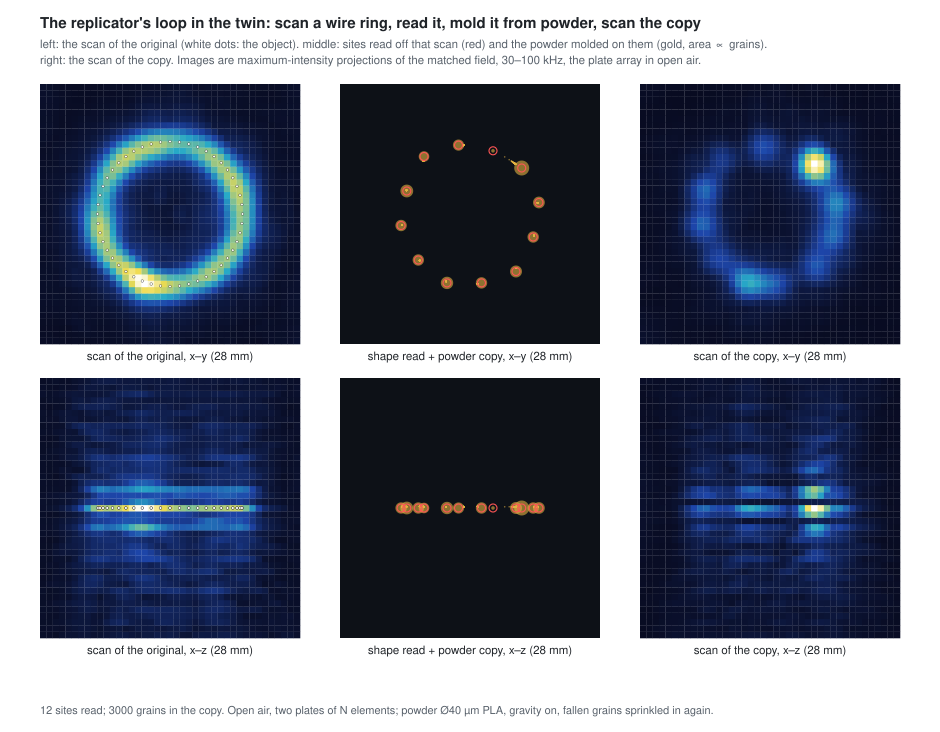

**A 12 mm tetrahedron frame: the reading step fails.** At the scan's ~2 mm
resolution a frame this small images as a blurred cage. Joining nearby peaks
built a 39-segment mesh instead of six edges: 88 % of its sites lie on the
frame (worst 4.0 mm), and it covers 69 % of it. The mold on that mesh puts
76 % of the cloud on it, but only 59 % within 1.5 mm of the original frame
(G-R1, G-R2, G-R3 fail). Reading a graph off an image needs a skeleton (or a
model fit), not proximity. That is the next step.

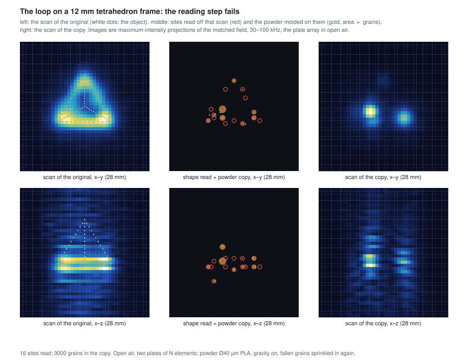

### Reading with light

Sound changes the air's refractive index, so a laser across the chamber
picks up a phase k_L (n₀ − 1)/(γ P₀) ∫ p dx. Strobed at each tone, a camera
behind a schlieren or interferometer reads the field's line integral
(`fieldc mold --light`). Through the compiled ring mold, a 633 nm beam picks
up up to 0.95 rad (rms over tones). That is easily measured, so light can
calibrate the twin against the real plates and render the field on screen.

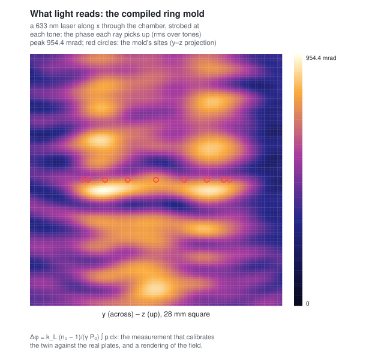

**Open / next:**

* The eigen-solve compile (seconds instead of minutes).
* Even filling that does not depend on orientation (more channels, more
  tones, or an objective on the catchments themselves).
* Streaming (the flows around foci).
* Grain–grain cohesion and the clump's own scattering.
* The plate element's real transfer, measured on the bench and then read
  with light.

## Round 11 — scan an object, then mold from powder (2026-09-30)

The replicator's own loop is to scan an object and then mold a copy in one
shot. Pick-and-place was the proving ground; this round does the two halves
of the loop.

**Scan (`fieldc scan3d`).** By reciprocity, a small scatterer at x couples gate
j to gate i through what each gate's field does there:

    ΔT_ij(f) ∝ −(f1/3) k²a³ p_i(x) p_j(x) − (f2/2) a³ ∇p_i(x)·∇p_j(x)

The chamber-only transfer is calibrated away. An object is a cloud of such
scatterers (Born approximation; the coupled solve for a few beads). The image
is the matched field over 90 frequencies from 30 to 100 kHz, every gate pair,
40 dB SNR, using the same exact glass-chamber fields:

    I(x) = |Σ_f Σ_ij M_ij(x,f)* ΔT_ij(f)| / (Σ|M|²)^½

| object | recall (object within 2 mm of a bright voxel) | bright voxels on the object | what it shows |
|---|---|---|---|
| 30 mm tetrahedron frame | 100 % | 14 % | the outline in x–y, blurred 2–3 mm; streaked in z by the plate mirrors |
| letter R, 40 mm | 99 % | 33 % | the letter, readable in x–z |
| the twin's own 4-bead tetrahedron | — | — | one blob: 0.36 mm across, below the resolution |

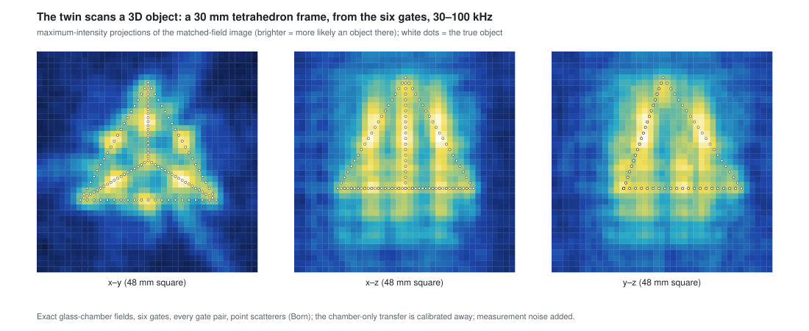
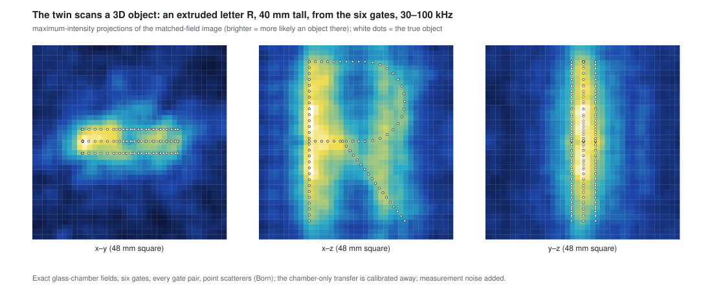

**Mold (`fieldc mold`).** A cloud of Ø40 µm PLA powder, 3000 grains, is
released at random through a ±10 mm volume. It moves in one compiled
multi-tone field, with gravity on. A grain relaxes in 6 ms in air, so it is
overdamped: it follows the field and does not swing, which is what defeated
single-bead carrying. Force and weight both go as a³, so small grains are not
weightless.

* **A mold of wells catches only what starts near the shape.** The force
  compiler, generalised to many wells (`--objective wells`), forms 13 of the
  16 wells of an 8 mm ring. It puts only 23 % of the cloud on the ring, and
  fills 5 of 16 sites (G-M1 and G-M2 fail). By starting distance from the ring:

  | start (mm from the ring) | 0–1 | 1–2 | 2–3 | 3–4 | 4–5 | 5–6 | 6–8 | > 8 |
  |---|---|---|---|---|---|---|---|---|
  | captured | 88 % | 93 % | 76 % | 37 % | 19 % | 6 % | 2 % | 0 % |

  A still field reaches a grain only within about λ/4 of its lowest tone
  (2.9 mm at 30 kHz). The rest settles in layers a wavelength above and below
  the ring. Gravity is not the limiter: runs without gravity, and at 16× the
  drive, give the same result.
* **No drive makes the whole volume slope toward the shape.** Asking for U to
  fall toward the nearest site at every point (`--objective funnel`) moves the
  funnelled share from 50 % to 52 %, which is chance. A resonant chamber's
  landscape repeats every half wavelength. The funnel objective is kept as the
  negative test.

  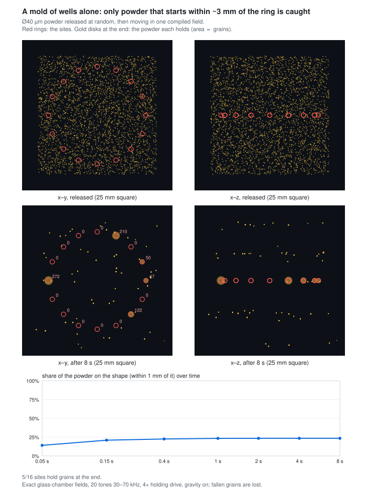
* **Gravity is the conveyor; the mold is a sieve.** A grain can come to rest
  only where the lift −∂U/∂z equals its weight. So the compiler instead makes
  the shape the only place that can hold a grain up (`compileSieve`). It
  maximises the weakest site's lift over the most that any point 1.5 mm or
  more from the shape can lift. In the power window between the two, the sites
  hold and every other grain falls. Powder that falls out is sprinkled in
  again at the top, as a hopper or a recirculating loop would. Three more
  terms make the powder spread evenly along the shape:
  * each site is a trap sideways, at its level and one step up, where a held
    grain rests;
  * the band where grains land funnels to the nearest site;
  * that funnel is weighted to the worst-served site. Averaged over all sites,
    the same 2 of 16 stayed empty run after run.

  **Result (40 tones, lift contrast 1.71, drive 1.31× the weakest site's
  hold; receipts at 77df809):** 99 % of the cloud is on the ring within 2 s
  and 100 % by 4 s. Nothing is left in a rogue well and nothing is lost; each
  grain was sprinkled in again 1.0 times on average (G-M2 passes). 15 of the 16
  sites hold powder (49–445 grains); the site at 247° stays empty and its
  neighbour takes a double share (G-M1 fails). Before the axis fix the same
  compile filled all 16 (86–321 grains).
* **The tetrahedron frame (12 mm edges, 10 sites) works too:** lift contrast
  1.94, 100 % of the cloud on the frame within 4 s, all 10 sites holding
  powder, but unevenly, 58–525 grains (G-M2 passes, G-M1 fails at 0.19 of a
  fair share against 0.25).

  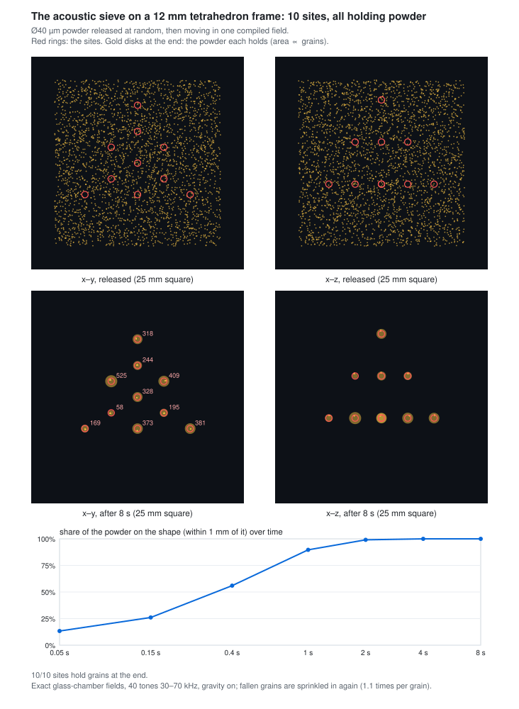

  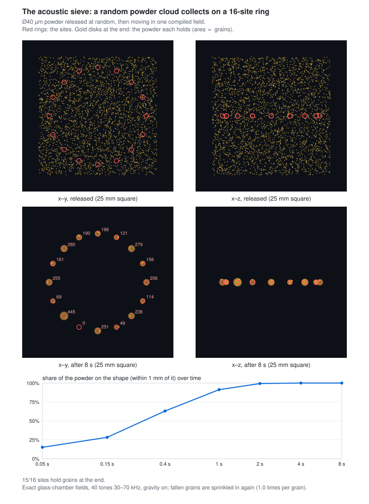

**What this asks of the machine.** Powder is dispensed from above, and what
falls through is collected and dispensed again. The drive sits inside a window
set by the lift contrast. At contrast 1.71 the drive power must stay within
−24 % … +31 % of the window's middle, so the drive level must be known that
well: calibrated through the scan, and tracked as the air warms (Round 6). The sites are 3.1 mm apart,
about λ/2 at the top of the band. A continuous part needs the clumps to merge
or be bridged (binder, sintering), which is not modelled.

**The axis bug (found 1 Oct, fixed at 77df809).** The first sieve compile of
the tetrahedron froze: its apex site, on the chamber axis, showed exactly zero
lift. Probe lattices are centred on their target with an odd point count, so a
target on the axis puts a lattice column exactly on x = y = 0. There the Metal
cavity kernel returned exact zeros for every tone and every component (φ =
atan2(0, 0) under fast math). The CPU reference was right for p but took the
m = ±1 gradient term J_m(μr)/r from a spline extrapolated below the table's
first step. Both now use the series below the first step and φ = 0 on the
axis. A new gate, G-GPU-CYL-axis, compares GPU and CPU exactly on the axis and
1 µm off it: 0.59 before, 6.3e-6 after. Every glass-chamber receipt with
on-axis content was re-run at 77df809 (Rounds 7, 8, 10 and 11 above). The
plates-only runs and the off-axis targets do not use this kernel. The
conclusions hold; the numbers moved by up to ~30 % (the 1-tone mid-plane ratio
0.88 → 1.19; the 5-tone chord 0.42 → 0.34). The sieve compile also no longer
lets a zero lift set a zero temperature. And G-M1 now needs every site to hold
at least a quarter of its fair share: a bare "every site has a grain" passed
the frozen run.

**Open:** an even share per site (G-M1). Not modelled: grain–grain contact and
cohesion, the clump's own scattering (`Scatterers` exists for it), and
streaming.

## Round 10 — part growth: the part is in the field (2026-09-30)

**Placed beads scatter** (`Scatterers`). Each bead scatters as a monopole
(compressibility contrast f1) plus a dipole (density contrast f2). It is driven
by its local field: the chamber's plus every other bead's scattered field, so a
cluster's multiple scattering is solved per gate (coupled dipoles). Everything
stays linear in the drive, so the part adds per-gate rows that the compiler,
the carry and the force balance all see. The gates:

* **G-S1:** the exact rigid-sphere series at ka = 0.1, matched to 1.3 %.
* **G-S2:** the time-averaged interaction energy of two beads in an
  oscillating flow, −(π/2) f2² ρ0 a⁶ v² (1 − 3cos²θ)/R³ (Koenig), matched to
  1.0 %. Beads attract side by side and repel end to end.

**What the part does to a build.** The part changes how every later bead
has to be placed:

* **A balance next to a neighbour is a saddle.** The neighbour's pull near
  contact is comparable to the trap's force. Beads therefore land 0.6 mm back,
  outside the ~5-radius capture range, and are slid in along the support. The
  slide trap is aimed on the chamber field alone, so trap and attraction pull
  the same way into contact.
* **Rows are laid across the local flow.** The first scattering build grew
  along y by itself: along the flow, neighbours repel.
* **Stacking is dropped, not pushed.** Above its neighbours a bead is end to
  end along the mostly vertical flow, where they repel. The repulsion scales
  with the drive, so more power does not help; gravity does not scale, so the
  top bead is centred 0.5 mm up and dropped.
* **Contact is physical.** The support pushes back and resists rolling. A bead
  that touches a placed bead is held by the binder as a liquid bridge. The
  machine then releases it, it settles under gravity along its contacts, and
  the bond cures.

The row passes (G-B1): all five beads on the support, gripped to their
neighbours, 10–13 µm from their sites (re-run at 77df809). The tetrahedron passes with its base
along y (G-B2): the base closes by attraction, and the top bead settles into
the pocket at 163.3 µm, which is 2a·√(2/3), touching all three.

**Open:** with the orientation chosen automatically, the tetrahedron's carries
still lose a bead. Traps are soft and can be saddles off-axis, so a carry path
must be checked for trappability before it is committed. Placed beads now take
up to 16× their weight from the traps that bring the next bead.

**Where this goes next.** Pick-and-place was the proving ground for the
compiler, the part's field and the bead dynamics. The replicator's own loop is
to scan an object, then mold a copy in one shot: one field whose wells form the
whole shape, filled with powder that is overdamped and follows the field
without swinging. That is the next round.

## Round 9 — the first build (2026-09-30)

**Five beads laid in a row (`fieldc build`, G-B1).** Five Ø200 µm PLA beads are
laid in a row on a support in the glass chamber. Each is loaded into the
unique 10-tone trap at the mid-plane and carried across and 2 mm down. It is
then lowered onto the support beside the previous bead, and fuses where it
first touches (a binder coat).

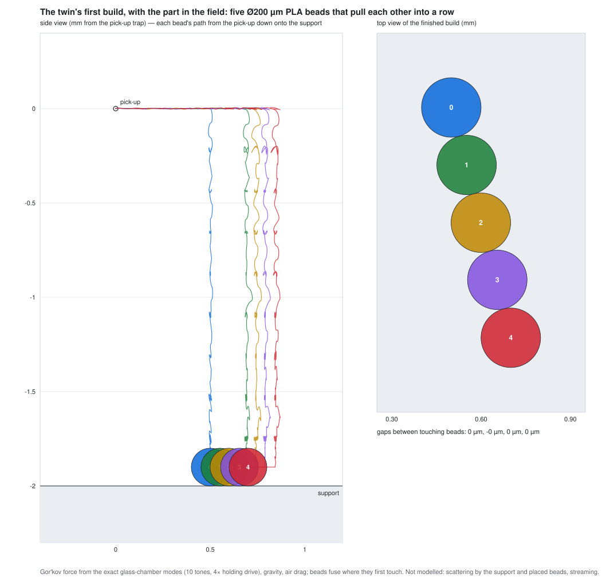

* **Compile the force balance, not the potential minimum.** A bead under
  gravity rests where the trap's force equals its weight, not at the
  potential's minimum. Compiled as a minimum, a loaded bead hung 0.2 mm low and
  0.5 mm aside, because the well is soft sideways and its axes tilt. That
  scattered the first attempt's beads by 0.3–2 mm, one perched on another.
  `moveWell` and `carryStep` now take the external force per unit drive power
  (∇U(x) = −(mg/P) ẑ), so the bead rests on its aim.
* **Solve the balance where the bead lives.** On the 0.63 mm probe lattice the
  interpolated balance point sat 1.2 mm from the fine field's. The balance is
  now re-solved on a 0.1 mm box of exact modal rows; the lattice still does the
  rival suppression.
* **Closed-loop placement.** Before and during the lowering, the twin reads
  where the bead hangs (as the machine's scan would) and moves the well by the
  bead's miss. Each next site is laid off the placed bead's actual position.
* **Result:** 5/5 beads on the support, 2–3.5 µm from their sites, neighbours
  7–9 µm apart. The aim was 10 µm, so a miss leaves a gap rather than a perch.
  The row is straight to ±2 µm, and the build takes 8.5 s of simulated time.
* **A requirement it found:** the traps that bring later beads push the placed
  ones with up to 4.5× their weight. The binder, or the fuse step, must hold
  that.

**A tetrahedron (`fieldc build --shape tetra`, G-B2): a bead laid on beads.**
Three beads are laid touching on the support, each off the others' actual
positions; the third goes at the apex of the triangle on the first two. A
fourth is lowered into their pocket. It first touched bead 1 and rests against
all three: gaps 1.7, 0.0 and 3.3 µm, 11 µm from the pocket. The base gaps are
5–9 µm, and the build takes 6.7 s of simulated time.

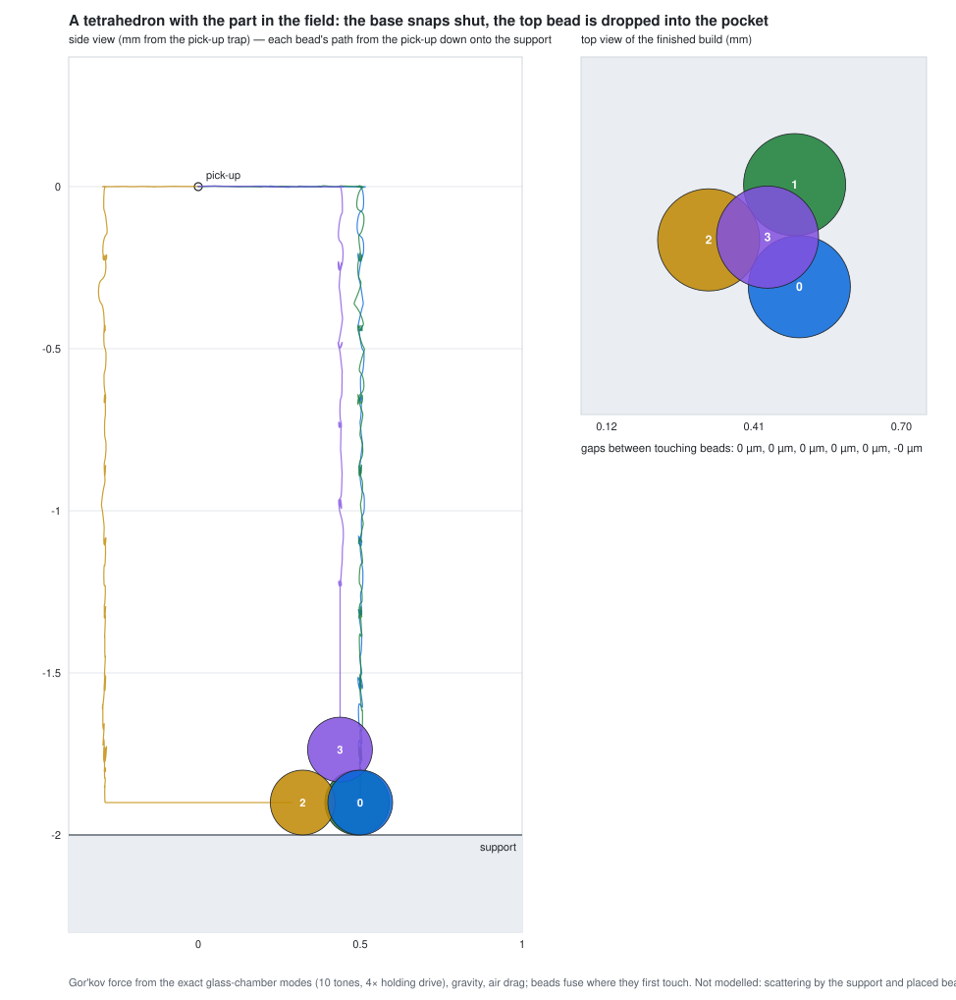

`python3 Tools/plot_build.py` redraws the row from `Receipts/build_*.csv`;
pass the `build_tetra_*` files, an output path and a title for the tetrahedron.

**Not modelled:** scattering by the support and the placed beads (the support
is taken as an acoustically open mesh); secondary Bjerknes forces between
beads; streaming; how the binder cures.

## Round 8 — how hard to drive, and how to carry (2026-09-29)

**Placement is pinned.** A force-compiled well now sits within λ/8 (≈ 1 mm) of
the requested point, positions sub-grid (a parabola per axis). The price in the
glass chamber at 10 tones: sibling ratio 0.24 → 0.36, still unique.

**`fieldc levitate` — the drive to hold a bead, in SI.** The rows are pressure
per unit aperture velocity (Pa per m/s), so a compiled drive is a set of
aperture velocities at horn coupling 1. The horn is still a stub, so these are
MODEL numbers until bench G-A0 measures the throat → aperture gain. The study
reads the largest upward force the trap's well offers along a 20 µm vertical
line, and scales the drive until that force carries the bead's weight. Force
and weight both scale as a³, so in the Rayleigh limit the answer depends on the
material, not the size. Hardest-driven gate, velocity amplitude (receipt):

| trap | PLA | aluminium | steel | field peak, PLA / steel |
|---|---|---|---|---|
| plates only, 5 tones | 26.3 m/s | 38.8 m/s | 66.2 m/s | 160 / 168 dB |
| glass chamber, 5 tones | 9.0 m/s | 13.2 m/s | 22.5 m/s | 162 / 170 dB |
| glass chamber, 10 tones | 4.5 m/s | 6.6 m/s | 11.2 m/s | 159 / 167 dB |

* The glass keeps the energy in: the same trap needs 2.5–6× less drive than the
  plates alone.
* PLA needs a ~160 dB field — the level working acoustic levitators use. Steel
  needs ~168–171 dB, where the air turns nonlinear (shock distance ~6 cm at
  160 dB) and streaming drag on fine powder rivals its weight. That is where
  the next physics layers — nonlinearity and streaming — stop being optional.
* Lateral stiffness is weak: 3–24 Hz for PLA at the holding drive.
* Re-run at 77df809 (the axis fix; the targets sit on the axis): the glass rows
  moved by up to 12 % (5 tones) and < 1 % (10 tones). The plates-only row moved
  ~3 % with the compiler's normalised gradients.

**`fieldc carry` — pick up, carry, place (G-P1).** Re-compiling at each step of a
path either kept the old well while the target moved away (three steps) or
hopped 4.5 mm to another. Placing the well by Newton alone kept it on the point
while the rivals grew until the trap was lost (0.43 → 0.97 in four steps). The
carry step does both at once:

* a Newton step on ∇U(x) = 0 — the smallest drive change that puts the well on
  the point (`ForceCompiler.moveWell`);
* a rival-suppression step projected onto that constraint's null space, so it
  does not move the well (`ForceCompiler.carryStep`).

In the bare glass chamber with 10 tones, the trap was carried 5 mm up and 5 mm
across in 40 steps of 0.25 mm. Every step was within 0.17 mm of its point,
continuous, and downhill from the old well. The bead's well stayed the deepest
throughout, never below 0.71 of its starting depth. 36 of 40 steps were also
globally unique (worst 0.72, the first). Global uniqueness is the loading
criterion; a bead already in its well needs its own well and a clear path.

**`fieldc fly` — a bead that moves (G-P2).** A 200 µm PLA bead is integrated
through the carried trap: time-averaged Gor'kov force from a 0.1 mm box of
exact modal rows around the path, gravity, Stokes drag (streaming ignored).
Each drive change is ramped linearly, then settles with the chamber's τ
(air absorption + plate loss, 3.5 ms at 50 kHz).

* **Dropped in and stepped hard, the bead is lost.** Air damps a 200 µm bead
  in ~150 ms and the trap is ~8 Hz sideways, so it never settles. Whether a
  step keeps it depends on the swing's phase: lost at 10 and 40 ms per step,
  carried at 20 and 80. The static carry (G-P1) is not enough for a real bead.
* **Loaded gently, with ramped steps, it rides.**
  * At 2× the holding drive: carried at every step time from 10 to 80 ms per
    0.25 mm step, ending 0.29–0.33 mm off the drop-off.
  * At 4×: carried at every step time down to 10 ms. The whole 10 mm path
    takes 0.4 s, and the bead ends 0.13–0.15 mm off the drop-off, which is its
    sag.
  * At 8×: carried, ending 0.07–0.08 mm off.
  * (Re-run at 77df809, after the axis fix: before it, the 2× bead escaped at
    10 ms and the 4× bead sagged 0.21 mm.)

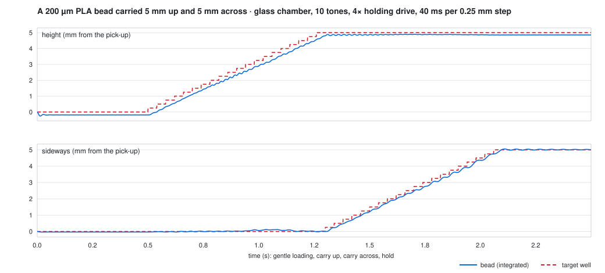

`python3 Tools/plot_fly.py` redraws it from `Receipts/fly_trajectory_4x_40ms.csv`.
The bead trails the stepped target by 0.2–0.5 mm going up (sag plus lag) and
wobbles ~0.2 mm sideways at the trap's 8 Hz. **Fine powder is a different
regime:** drag goes as a/a³, so a 30 µm grain is overdamped (1/e in ~3 ms)
and would follow the trap without swinging, but there streaming and
cohesion take over.

**Not modelled yet:** cross terms during a ramp (the potential is blended,
not the drive); acoustic streaming; several beads at once; the horn.

## Round 7 — the glass chamber (2026-09-29)

**The build chamber is a glass cylinder, and the twin now has it.**
`CylinderCavity` solves the chamber as an exact modal sum: the rear glass
(Ø444 OD, 4 mm wall → a = 218 mm) between the two plates, 460 mm apart.

    p = Σ_mn J_m(γr) e^{imφ} [W0 Z0(z) + WL ZL(z)]

Along z the plate images are summed in closed form; across the chamber every
glass reflection is exact (4 mm glass is a mirror: 69–83 dB transmission loss
at 40–200 kHz). At 40 kHz ~9 000 mode coefficients per gate stand in for
17 184 apertures × 7 image paths — the chamber's screen, made literal. One
Miller table serves every Bessel order; `CavityFieldsGPU` runs the sum on Metal.

**A lined glass wall, exactly.** A liner of specific admittance β sets
∂p/∂r = ikβp on the wall. Each mode's zero is continued from its rigid j′ₘₙ to
the root of x J′ₘ(x) = i(kaβ) Jₘ(x), and Jₘ at the complex argument is read off
the same real table by the multiplication theorem (DLMF 10.23.1), on the CPU
and in the kernel. Low modes graze the wall and turn pressure-release-like
with little loss; modes that meet it head-on are the ones a liner kills. (The
first-order perturbation this replaced fails once kaβ ≳ j′ — β ≈ 0.05 at
40 kHz already.)

| gate | checks | result |
|---|---|---|
| G-CYL1 | far wall absorbing → the half-space Rayleigh field | < 5e-3 |
| G-CYL2 | closed rigid cylinder rings at its analytic (0,0,1), (1,1,0) frequencies | pass |
| G-CYL3 | plate-mounted sources: 16-order image series = the cavity's plate series | 1.1e-5 |
| G-CYL4 | lined-wall zeros vs 30-digit mpmath continuations | 2e-9 |
| G-CYL5 | lossless air, lined wall: power in = power into the liner | 1.1e-6 |
| G-CYL6 | lined field: Helmholtz / wall condition / gradient vs finite differences | 1.1e-4 / 2e-10 / 1e-5 |
| G-GPU-CYL, -lined | Metal vs CPU, p and ∇p, bare and lined | 8.3e-6 / 8.5e-6 |

**A bug the cavity caught.** The image model placed a plate-mounted aperture
between the walls and then added that plate's own image at the source point —
but the Rayleigh prefactor already baffles it, so every image came twice and
the field was (1 + R) = 1.9× too strong. Up to the last truncated image that is
a uniform scale, so ratios barely moved, but absolute pressure was 1.9× high,
which matters the moment drives are in SI units. Fixed on the CPU (2fbccfb);
`fieldc gpu` then caught the Metal kernels still doing it (G-GPU-FS read 0.90),
fixed in 50eb595.

**A force compiler that works in speckle.** In the glass chamber the heuristic
refinement (penalise the 24 deepest siblings) returned its GS-PAT start
unchanged: hundreds of speckle wells, and with five tones it scored worse than
one tone can — which no optimum can. `ForceCompiler.smooth` minimises the
softmax of every rival well's depth over the target well's with Adam on the
unit sphere of drives, from an exact adjoint (checked against finite
differences, 1.5e-9); a chord starts from each tone compiled alone (equal,
quality-weighted, and the best tone alone). Everything below uses it.

**What the glass does to a trap, and what brings it back** (`fieldc forcetrap
[--glass]`, `fieldc tonesweep`, `fieldc wallsweep`; receipts at 00bcc24; every
glass row with its target on the axis re-run at 77df809, after the axis fix —
see "The axis bug" below).
Sibling ratio, force compiler (< 0.5 = one trap; siblings above half depth in
brackets):

| chamber, target | 1 tone | 3 tones | 5 tones | 10 tones | 20 tones |
|---|---|---|---|---|---|
| plates only, mid-plane | 0.91 | | **0.25** (0), G-F1 | | |
| plates only, 100 mm above the lower face | 0.90 | | **0.31** (0) | | |
| bare glass, mid-plane (30–70 kHz grid) | 1.19 | | **0.34** (0) | | |
| bare glass, mid-plane (tonesweep spacing) | 1.01 | **0.41** (0) | 0.66 | **0.33** (0) | **0.14** (0) |
| bare glass, 60 mm off-axis | | | **0.49** (0) | **0.22** (0) | **0.18** (0) |
| bare glass, 100 mm above the lower face | | | **0.33** (0) | | |
| GS-PAT chords only, mid-plane | 6.91 | 1.22 | 4.35 | 0.65 | 0.83 → 0.45 at 80 tones |

* **Glass turns the field into speckle**, and a pressure-objective chord needs
  ~80 tones to find its way back to one trap. **Force-compiled, 3–10 tones
  suffice**, on axis and off it — the time–bandwidth argument (I1 below) holds
  in the exact chamber. Tones are drives.
* **A liner is not the lever.** With the force compiler the 5-tone chord reads
  0.34 with bare glass, 0.39 / 0.38 / 0.43 / 0.57 behind liners of normal-
  incidence R = 0.9 / 0.7 / 0.5 / 0.3, and 0.34 behind a ρc-matched one
  (re-run at 77df809; before the axis fix 0.42, 0.42–0.64 and 0.36). A
  locally reacting wall reflects grazing waves whatever its β —
  R(θ) = (cos θ − β)/(cos θ + β) → −1 — and a partial liner's reflection phase
  turns with angle, which scrambles the field further. (An absorber that
  works at grazing incidence — thick, bulk-reacting — is not modelled.)
* **Temperature decides how often to re-compile.** In the glass chamber a held
  5-tone drive stops being unique by +0.1 K (0.60) and loses the trap by +0.3 K
  (1.13); re-compiled at the true temperature it is unique again — 0.44, 0.48,
  0.29 at +0.1 / 0.3 / 1 K — and through +0.3 K it has not moved. So the twin
  must track the air to ~0.1 K and recompile, which is what the fast compiler is
  for. (`fieldc drift`, GS-PAT traps: the glass decorrelates a held trap within
  +0.1 K; a ρc liner makes the drift smooth — 137 / 368 / 496 / 705 µm at
  +0.1 / 0.3 / 1 / 3 K — but does not stop it.)
* **Placement is loose.** A force-compiled well may sit up to λ/4 from the
  requested point (1.9 mm on the plate-only chord); building needs it on the
  point. Next: pin the target in the objective.

## Round 6 — temperature, port fields, and the free-standing machine (2026-09-29)

Prompted by two external reviews of the chamber-engine plan (Kin note "The
twin's chamber engine: two reviews checked…").

**Air is a model input now.** `Medium.air(temperatureC:humidity:pressure:)` gives
sound speed and density from an ideal-gas mixture of dry air and water vapour,
and absorption from ISO 9613-1: 343.87 m/s at 20 °C / 50 % RH, **+0.182 %/K**;
4.66 dB/km at 1 kHz (the ISO table value), 1.32 / 3.28 / 8.23 dB/m at 40 / 100
/ 200 kHz. Absorption acts on every path, images included; the horn channels
hold the same air (c/√τ), so they drift too. The fixed §12 media are unchanged,
so every earlier receipt still replays.

**Port fields on the GPU.** `PortFieldsGPU` builds the gate-granular operator for
any preset — horn couplings, wall images, absorption — and hands the CPU
pipeline a `Propagator(precomputedH:)`. The whole chamber at λ/2 (792 100 points
× 6 gates, 17 184 apertures × 7 wall paths ≈ 10¹¹ terms) builds in **3.3 s**;
after that every drive is a six-column sum. **G-GPU-FS** holds it to the CPU
reference: 1.3e-5 at 40 kHz, 5.3e-5 at 100 kHz (bar 1e-4).

**How fast a compiled trap goes stale** (`fieldc drift`, receipt): compile a twin
trap at 20 °C, hold the drive, warm the air.
* Direct paths only, the node moves by d·Δc/c (d = distance from the mid-plane):
  **G-T1** passes, +340 µm vs +329 µm closed form and −775 vs −712 µm at +3 K.
* With both plates as mirrors (3 image orders, R = 0.9), multipath turns the
  drift into decorrelation: at 40 kHz the trap moves 40–900 µm within +0.3 K,
  and at 100–200 kHz 0.1 K is enough for a sibling well to take over.
* Re-solving the drive at the TRUE temperature pulls on-axis traps back 2–4×
  with direct paths, but in the reverberant case it lands in a different well:
  the pressure-objective twin trap is not unique with 6 drives. So modelling
  temperature is necessary, not sufficient — the force compiler (Gor'kov
  potential as a quadratic form in the gate vector, sibling wells penalised)
  comes before thermal correction can work.

The live Compile shows the same thing honestly: all 4 000 wells lie within 45 %
of the deepest, median miss 10 mm.

**The force compiler** (`ForceCompiler`, `fieldc forcetrap`). Per tone the Gor'kov
potential is an exact quadratic form in the gate drive, U(x) = gᴴK(x)g, built
from the port-field rows and their analytic gradients (a GPU kernel,
**G-GPU-FS-grad** 1.4e-5). The gradients now include the piston directivity's
angular slope — the old "locally constant" shortcut missed 1–2 % of the lateral
gradient at ka ≈ 1.8 — so rows match finite differences to 1e-8. A well's depth
(shell mean − centre) is then a quadratic form too; the compiler maximises the
target's depth and penalises every competing well deeper than half of it, from
several starts (eigenvector, GS-PAT), warm-starting when the room changes.
* One tone, 6 drives: no unique trap anywhere (sibling ratio 0.94, 8–32 wells
  above half depth). Contrast is capped near the number of drives.
* **Five-tone chord (30 drives) at the mid-plane: G-F1 passes — sibling ratio
  0.43, no competing well within ±17 mm above half the target's depth, 0.6 mm
  from the requested point.** The first unique trap the twin has produced on the
  plate machine; the GS-PAT chord makes no well at the target at all. Warming
  with the drive held, it does not move (0 µm through +1 K); it stays unique to
  +0.3 K (0.49) and loosens by +1 K (0.66).
* 100 mm above the lower face the chord reaches 0.80 — the same as GS-PAT: the
  plate's own standing wave keeps 22 siblings there.

**Still missing** for these numbers to be the machine's: the glass cylinder
(the walls are the two plates only — added in Round 7), the horn (a labelled
stub), and SI drive units.

## Round 5 — what building the machine found (2026-09-28)

Building the geometry surfaced design facts no paper had written down, and
two physics bugs that had been shaping documented results.

**Design findings** (details and reconciliation table in [`CAD.md`](CAD.md)):
only **128 of the 380** sunflower sites can be drilled — 252 fall inside a
spiral slot or its web; per face the slots are **34,600 mm² open against
~2,700 mm²** of micro-horn faces (12.8×), so if the slots are open voids they
*are* the acoustic aperture — **operator ruling needed: open or
dielectric-filled?**; the "21 × 34" parastichies are the mid-field reading
(13 × 21 inside, 34 × 55 at the rim); three Ø25 throat piezos on r = 18 reach
0.5 mm into the Ø12 bore (model uses Ø20); the spec's storage chamber and its
own middle stack overlap (the site's layout is the one that closes); the
model weighs ≈69 kg against the spec's "≈50 kg class".

**Bugs, continuing the numbering:**

15. **Wall image series wrong beyond first order.** Every extra order re-added
    the two first-order images (so they carried R + R² + R³ = 2.44 instead of
    0.9) and put fourth-order images where third-order ones belong. The series
    is now derived per bounce count and pinned by a test against an explicit
    alternating-reflection recursion.
16. **The inverse solver optimized a different machine.** Its control matrix
    re-walked the elements in free field with no wall images, no element
    weights and no couplings — so every "walls" and "rainbow" condition solved
    its drive for a machine it was not then evaluated on. With the image
    series corrected, the walls + rainbow condition turned **NaN**, which is
    how it was found. The control matrix now comes from `Propagator.gateRow`,
    the same path as the cached operator.
17. **Point evaluators ignored walls, weights and couplings** — `pressure(at:)`
    and `velocity(at:)` could silently disagree with `forward`. One code path
    now; a test checks agreement with walls and complex couplings on.
18. **The drilled-hole set depended on display tessellation** (200 vs 400
    slot samples changed which sites a slot swallowed). Design facts are now
    decided at a fixed fine resolution; the unit suite caught it.
19. **An 8-sided winding carried 90 % of the round wire's copper**, which the
    STEP cross-check would have reported as a kernel disagreement. Wire
    polygons now use an area-equivalent circumradius.

**G9d / I1 re-run on the corrected model** — the retraction below stands,
now for the right reasons:

| condition | RH-1 | dense | RH-1 relative |
|---|---|---|---|
| 1 tone, free field | 1.088 | 1.097 | 0.99× |
| 1 tone, walls | 1.136 | 1.094 | 1.04× |
| 5 tones, walls | 1.052 | 1.231 | 0.85× |
| 5 tones, walls + rainbow | 1.093 | 1.305 | 0.84× |

**First study of the plate-primary machine** (`fieldc plates`, receipt
`plates_*.json`). Six throat gates, phase-conjugate drive at the chamber
centre, the two plates as walls. MODEL numbers — the throat → aperture
transfer is the `HornModel` stub:

| condition | apertures | focus contrast | parasitic/main |
|---|---|---|---|
| 1 tone, free field, slots open | 3,688 | 9.3 | 1.05 |
| 1 tone, walls, slots open | 3,688 | 9.5 | 1.02 |
| 5 tones, walls, slots open | 3,688 | 7.0 | 1.00 |
| 1 tone, walls, slots closed | 256 | 14.8 | 1.00 |
| 5 tones, walls, slots closed | 256 | 7.3 | 1.00 |

Read it plainly: the plates do focus (focus contrast = peak intensity over
the mean of a ±3λ neighbourhood; not comparable to the desktop's whole-volume
amplitude gain), and open slots cost a third of the single-tone contrast. But
parasitic/main sits at 1.0 in every condition: a point-conjugate drive
between two facing apertures makes an axial standing wave whose λ/2 nodes
are equally deep, and neither more tones nor the rainbow selects one of
them. Holding *one* grain needs a trap signature (twin, vortex, bottle) or
face-to-face amplitude asymmetry — that is the next study, not a verdict on
the machine.

## Four bugs the gates caught

Recorded because they are the argument for gate-first development.

1. **Gor'kov closed form wrong by −3.** The literature's
   `F = 4πa³kE_acΦsin(2kz)` uses the Settnes–Bruus contrast factor (Φ_B = Φ/3)
   *and* a cos() pressure convention. Against a sin() field the correct form is
   `F = −(4/3)πa³kE_acΦsin(2kz)`. Getting this wrong **inverts the trap** —
   nodes become antinodes — and produces a plausible-looking levitation sim that
   is wrong everywhere. Verified by symbolic differentiation. Spec corrected.
2. **FDTD energy measured at the wrong point in the leapfrog cycle.** The
   discrete invariant pairs *consecutive half-step* velocities; squaring one of
   them drifts at O(dt²). Energy is now sampled after the velocity update and
   before the pressure update, where p^n, v^{n−1/2} and v^{n+1/2} are all in hand.
3. **The propagator was element-granular.** Elements are the discretization of
   the radiating surface; **gates** are what the electronics can drive. An
   element-granular operator over a 2.5M-point lattice is ~470 GB and was killed
   by the OOM killer. Gate-granular it is ~100 MB — and it is also the correct
   control granularity.
4. **Diff-PAT was mis-scaled by orders of magnitude.** H carries physical units,
   so |Hu| at unit drive is ~10³ while the nominal target is 1; Adam drove the
   solution toward zero chasing an unreachable target, scoring 0.20× against
   IBP's 10.77× — the "optimizer" made it 50× worse. Targets are now rescaled to
   what the aperture can deliver.

Two more were *metric* bugs, not physics bugs, and equally instructive: the
evaluation lattice initially included the transducer planes (where 1/r diverges,
so the field maximum is always a source), and the sidelobe metric flood-filled
to −6 dB and then measured the first voxel outside, which by construction
returns −6 dB regardless of beam quality.

## Open issues

- **G9b sidelobe bar not met and escalated, not ratcheted.** The spec's −10 dB
  was written without a reference configuration. Measured: −9.0 dB on-axis
  (16×16, f/0.62), −7.6 (f/1.24), −8.6 (24×24), −9.1 (32×32); −7.2 dB off-axis.
  The textbook −13.2 dB is a *continuous* aperture in the *far* field and does
  not apply to a discrete λ/2 array focusing in the Fresnel zone. Lateral
  placement is exact, so the solver is sound and the bar was wrong. Per §20 law
  L5 this reports informational and **needs an operator ruling**, rather than
  being edited quietly to whatever was measured.
- **Drive amplitudes are not physical in `fieldc focus`.** `maxAmplitude` is
  dimensionless there, so "holds 200 µm PLA: no" is not a real result. The
  force compiler's drives ARE in SI (aperture velocity, m/s) — see `fieldc
  levitate`, Round 8 — but the horn coupling behind them is a stub.
- **`I1` RETRACTED as originally stated — do not send it to the hardware lane.**
  The first pass measured RH-1's 24 channels at 10.8× focusing gain vs a
  512-channel array's 18.0× and read it as "24 DOF cannot focus". That number
  came from a **free-field, monochromatic, pressure-domain** model, which assumes
  away three designed-in precision levers of this machine:
  1. **The cavity is the aperture.** Rayleigh–Sommerfeld is open air; RH-1 is a
     closed high-Q cavity. Time-reversal focusing *through* the multipath means
     controllable DOF scale with the time–bandwidth product B·τ_reverb, not with
     channel count — published down to single-channel focusing in chaotic
     cavities. This is the same multi-bounce lever ranked first for imaging in
     §18, applied to transmit by reciprocity.
  2. **The spectrum is the address bus.** The printed holograms steer by
     frequency, so a chord is 24 DOF *per tone with per-tone aperture patterns*,
     not the same 24 DOF louder. A frequency-flat gate→element map models a plain
     array, not RH-1.
  3. **Force, not spot size.** For well-separated tones the cross terms
     time-average out, so per-tone Gor'kov potentials add — co-locate the main
     lobes and the sidelobes land elsewhere and average down.

  Now implemented: cavity walls (axial image sources) and per-tone rainbow
  gate→element weights in the machine model, and a force-level gate **G9d —
  parasitic-to-main trap depth ratio under an N-tone chord**. `fieldc broadband`
  reruns 24-vs-dense at **equal time–bandwidth** across four conditions.

  **Result — the original finding does not survive.** Parasitic/main trap depth
  ratio (lower is better), RH-1 24-ch vs a dense 200-ch array:

  | condition | RH-1 | dense | RH-1 relative |
  |---|---|---|---|
  | 1 tone, free field *(the old model)* | 1.088 | 1.097 | 0.99× |
  | 1 tone, walls | 1.088 | 1.073 | 1.01× |
  | 5 tones, walls | 1.055 | 1.231 | 0.86× |
  | 5 tones, walls + rainbow | 1.073 | 1.071 | 1.00× |

  24 channels are **within ±14% of a 200-channel array on the force-level
  metric in every condition** — nowhere near the 2× that would justify escalating
  a channel-count finding. **Nothing goes to the hardware lane.**

  Read this as a *retraction*, not as a new positive claim. Two honest caveats:
  the absolute ratio sits near 1.0 for **both** apertures, which may mean a
  single-point conjugate drive leaves comparably deep competing traps regardless
  of channel count (real physics — the λ/2 lobe structure) *or* that the metric
  does not yet discriminate; and the walls are axial image sources only (the two
  caps), not the full cavity. Distinguishing those needs a multi-point drive and
  T1 walls, and is not done.

## Principles alignment round

Four gaps against `replicator_principles.html` v1.0, all now built and tested.

**§3 — chord-valued drive.** The drive was `[Complex]`: one number per gate at
one implied frequency, expressing 2 of the 11 knobs in the §3 table and unable
to represent a chord at all. `ChordDrive` is a set of tones, each with its own
per-gate vector, plus orbital order — so "send a chord" and "frequency is the
address" are expressible rather than aspirational. Power is shared across tones,
not stacked.

**§5 — Dissolve, the missing verb.** *"Assemble and dissolve are the same drive
separated by one sign flip."* Now literally true: `.dissolve` conjugates every
gate amplitude. But the claim is about ENERGY FLOW, so it is tested as one — the
net acoustic intensity through a box around the workpiece must **reverse sign**
between the verbs. A sign flip that doesn't reverse the flux is a relabelled
pump.

**§6 — call-and-response.** The build was open-loop: solve once, emit, stop. The
giveaway was an asymmetry — the chord list was only ever an *output* of scan,
never an *input* to build. `CallAndResponse` makes it the input, the target and
the stopping test, with a "rings true" tolerance, a stall detector, and an error
metric where a **missing** resonance costs as much as a wrong one (otherwise a
workpiece ringing at nothing scores perfectly).

**§4 — `Z(r)`, the compiler's second output.** `SurfaceHologram` implements
`Z(r) = X₀ + M·Re{Ψ*ref·Ψobj}`, deliberately machine-agnostic per Memory &
Compute's "one toolchain, three back-ends". Tested by reconstruction: replaying
the reference must concentrate at the target, not merely produce a texture.

Three more bugs, all caught by writing the tests rather than the code:

12. **Twin-image convention in the hologram.** Storing the *diverging* wave a
    target would radiate puts the focus on the real twin image — measured 23 mm
    off target with no concentration at all (0.94× the plane mean). An emitting
    aperture must store the **converging** wave; then the focus lands on the
    |R|² term where it belongs.
13. **I expected dissolve to match assemble in magnitude.** It doesn't, and the
    reason is physics: conjugating the *drive* is not time-reversing the
    *problem* — the Green's function still radiates outward. A finite boundary
    recaptures only the fraction it subtends, which is exactly why the papers
    insist CPA needs conjugate control of both counter-propagating channels.
    Asserting equal magnitude would have been asserting a perfect absorber.
14. **A converging test case that diverged.** My loop test had the measured
    weight decreasing *past* the target, so the error grew and the loop correctly
    reported a stall. The test was wrong, not the loop.

## Audit round — what the gates found

**G5 (the keystone) now passes at 0.042 against a 0.05 bar**, and a resolution
sweep shows textbook second-order convergence — 0.159 / 0.088 / 0.057 / 0.042 at
λ/6, λ/8, λ/10, λ/12, against predicted (Δ)² ratios of 1.78 / 1.56 / 1.44. So the
residual is **FDTD grid dispersion in the reference solver**, not an error in the
propagator: T0 is validated, and every field slice, trap and particle in the
viewport rests on something now checked rather than asserted.

Four bugs surfaced getting there:

8. **Time-convention mismatch in G5.** T0 writes outgoing waves as `exp(+ikr)`,
   which is outgoing only under `exp(-iωt)`. The phasor extractor assumed
   `exp(+iωt)`, so the gate compared an outgoing wave against an **incoming**
   one; they differ by a distance-dependent phase `2kr` that no single complex
   scale can absorb, and the residual pinned at 0.989.
9. **Coverage asked the wrong question.** It summed `cos θ` over gates that could
   see a *location* — but every interior point is visible to some gate, so it
   returned ~1 everywhere and reported **0.0% of the volume unobserved for a
   12-gate ring**. Specularity is about *orientation*: a facet is measurable only
   if some (Tx,Rx) bisector is parallel to its normal. Rewritten as bisector
   coverage of the orientation sphere, with the acceptance angle derived from
   facet size (`asin(λ/2D)`) rather than picked. Honest answer for this ring:
   **coverage p10 0.24, median 0.37, p90 0.48** — it catches about a third of
   facet orientations.
10. **G10 truncated a joint fit.** Each chord's amplitude was solved with the
    others present, so dropping chords leaves the survivors mis-weighted — the
    error curve came out non-monotone (K2 worse than K1, K16 worse than K8),
    which reads as an extractor fault but is an invalid comparison. Refitting per
    subset makes it exactly monotone.
11. **G5's domain was fixed in cells, not wavelengths.** Refining the grid shrank
    the physical domain, moving the sample annulus toward the source and sponge —
    a resolution sweep read non-monotonically (0.130 at λ/8 but 0.076 at λ/16)
    and would have been misread as the propagator failing at high resolution.

## Known defects in the scan pipeline — do not trust these outputs yet

1. ~~Chord amplitude fit does not reconstruct.~~ **Fixed** — shifted QR,
   model-order sweep, DC-artifact rejection. G18 passes at 0.122.
2. ~~Coverage is too generous.~~ **Fixed** — see the audit round above.
3. **G14a/G14b still report IoU 0.** The reconstruction is a reflectivity image
   thresholded at 0.35 of peak, which does not align with the object's occupancy
   at this scan resolution. The gates are informational by design (a bar there
   would reward hallucination), but the numbers are not yet meaningful.
4. **Drive amplitudes are still not in SI**, so no force or stiffness number is
   quotable and G8 stays blocked.

## Three more bugs the gates caught this round

5. **Scattering matrix was a Gram matrix.** The scan summed all drives into one
   record set, which destroys the per-drive structure. `S = Σᵢdᵢdⱼ` is symmetric
   *by construction*, so the reciprocity QC read exactly 0.0000 and was testing
   nothing. Now keeps `S[rx][tx]` per drive; reciprocity reads 0.001 and is a
   real measurement.
6. **FDTD ran at λ/2.1.** The scan drove 40 kHz on a 4 mm grid — well below the
   λ/5 the spec itself requires (§12), so the propagating wave was numerically
   garbage. The drive frequency now follows the grid (`c/8dx`).
7. **Unshifted QR cannot resolve complex-conjugate eigenvalues.** The pencil's
   `Z` is real, so its eigenvalues come in conjugate pairs, and unshifted QR
   provably stalls leaving 2×2 blocks — reading the diagonal returned only real
   numbers, so **every chord came out at f = 0 Hz**. Now reads the
   quasi-triangular form and solves each 2×2 block's quadratic.

## Toolchain constraints (verified on this machine)

- **No Xcode**, CommandLineTools only. SwiftUI/Metal/MetalKit still compile.
- **`XCTest` is unavailable** without Xcode, so `swift test` cannot build. The
  suite runs through a ~60-line harness in `FieldCore/Testing` via `fieldc test`.
  Consequence: tests run anywhere Swift does, including bare CI containers.
- Metal shaders must be compiled **at runtime** from source
  (`makeLibrary(source:)`); the offline `metal` compiler needs Xcode. This also
  makes kernels hot-reloadable.
